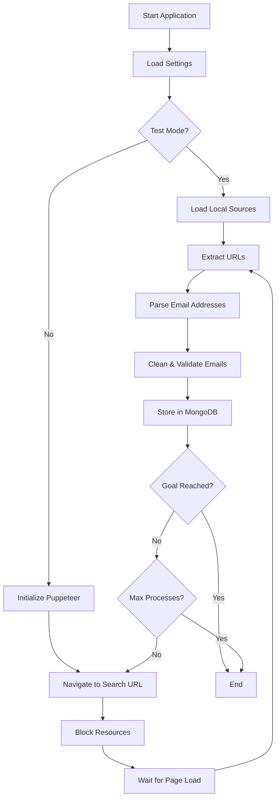

# Puppeteer Email Scraper

A Node.js web scraping application that uses Puppeteer to search for job listings and extract email addresses from search engine results. Specifically designed for Hebrew job searches in the Israeli market.

Built in January 2019. This application demonstrates crawling search engine results, extracting URLs, parsing email addresses, validating and cleaning data, and storing results in MongoDB.

## Features

- 🔍 Automated search engine crawling using Puppeteer
- 📧 Email address extraction and validation
- 🧹 Extensive email cleaning and normalization (Israeli domains)
- 💾 MongoDB storage with duplicate prevention
- ⚡ Performance optimization with resource blocking
- 🧪 Test mode support for development
- 🇮🇱 Hebrew search query support
- 🔧 Configurable search parameters and limits

## Architecture



## Data Flow


## Getting Started

### Prerequisites

- Node.js (v10 or higher)
- npm or yarn
- MongoDB (local or remote instance)

### Installation

1. Clone the repository:
```bash
git clone https://github.com/orassayag/puppeteer-example.git
cd puppeteer-example
```

2. Install dependencies:
```bash
npm install
```

3. Ensure MongoDB is running:
```bash
mongod
```

### Configuration

Edit the settings in `src/settings/settings.js`:

```javascript
{
  IS_TEST_MODE: true,                              // Test mode vs live crawling
  SEARCH_ENGINE_TYPE: 'bing',                      // Search engine to use
  GOAL: 1000,                                       // Target email count
  MAXIMUM_SEARCH_PROCESSES_COUNT: 100,             // Max search iterations
  SEARCH_ENGINE_PAGES_COUNT_PER_PROCESS: 3,       // Pages per process
  MONGO_DATA_BASE_CONNECTION_STRING: 'mongodb://localhost:27017/crawl'
}
```

Customize search terms in `src/core/lists/searchKeys.list.js`:
- Job keywords (want)
- Professions (profession)
- Cities (city)
- Email keywords (email)

## Usage

### Run the Application

```bash
npm start
```

The application will:
1. Connect to MongoDB
2. Begin crawling based on configured search parameters
3. Extract and validate email addresses
4. Store unique emails in the database
5. Stop when goal is reached or max processes completed

### Development Mode

For testing without live crawling:
1. Set `IS_TEST_MODE: true` in settings
2. Place test HTML files in the `sources/` directory
3. Run the application

## Project Structure

```
puppeteer-example/
├── src/
│   ├── core/
│   │   ├── enums/              # Color and search enums
│   │   │   └── files/
│   │   ├── lists/              # Search keys and filters
│   │   └── models/             # MongoDB schemas
│   ├── logics/                 # Main business logic
│   │   └── crawl.logic.js
│   ├── scripts/                # Entry points
│   │   └── crawl.script.js
│   ├── services/               # Services layer
│   │   └── files/
│   │       ├── database.service.js
│   │       ├── searchKey.service.js
│   │       ├── setup.service.js
│   │       └── source.service.js
│   ├── settings/               # Configuration
│   │   └── settings.js
│   └── utils/                  # Utility functions
│       └── files/
│           ├── color.utils.js
│           ├── file.utils.js
│           ├── log.utils.js
│           ├── path.utils.js
│           ├── system.utils.js
│           ├── text.utils.js
│           ├── time.utils.js
│           └── validation.utils.js
├── sources/                    # Test sources (test mode)
├── dist/                       # Output directory
├── package.json
├── README.md
├── LICENSE
├── CONTRIBUTING.md
└── INSTRUCTIONS.md
```

## Key Components

### CrawlLogic
Main orchestration logic for the crawling process.

### TextUtils
Extensive text processing utilities including:
- Email address extraction
- URL extraction
- Email cleaning and normalization
- Domain parsing

### DatabaseService
MongoDB connection and operations.

### SearchKeyService
Manages search query construction from configured keywords.

## Email Cleaning

The application includes sophisticated email cleaning for Israeli domains:
- Fixes common typos (`.co` → `.co.il`, `.ill` → `.il`)
- Removes invalid characters
- Handles `mailto:` links
- Validates against email regex
- Uses the `validator` library for final validation

## Performance Features

- **Resource Blocking**: Blocks images, stylesheets, fonts, and scripts for faster page loads
- **Request Interception**: Puppeteer request interception for fine-grained control
- **Configurable Limits**: Control search depth and total processes
- **Database Indexing**: Unique constraint on email addresses prevents duplicates

## Built With

- [Node.js](https://nodejs.org/) - JavaScript runtime
- [Puppeteer](https://pptr.dev/) - Headless browser automation
- [Mongoose](https://mongoosejs.com/) - MongoDB object modeling
- [Validator](https://www.npmjs.com/package/validator) - String validation
- [fs-extra](https://www.npmjs.com/package/fs-extra) - File system operations
- [log-update](https://www.npmjs.com/package/log-update) - Terminal output
- [ESLint](https://eslint.org/) - Code quality

## Development

### Linting
```bash
npm run lint
```

### Testing
Test with local HTML files by enabling test mode in settings.

## Contributing

Contributions to this project are [released](https://help.github.com/articles/github-terms-of-service/#6-contributions-under-repository-license) to the public under the [project's open source license](LICENSE).

Everyone is welcome to contribute. Contributing doesn't just mean submitting pull requests—there are many different ways to get involved, including answering questions and reporting issues.

For more details, see [CONTRIBUTING.md](CONTRIBUTING.md).

## Author

* **Or Assayag** - *Initial work* - [orassayag](https://github.com/orassayag)
* Or Assayag <orassayag@gmail.com>
* GitHub: https://github.com/orassayag
* StackOverflow: https://stackoverflow.com/users/4442606/or-assayag?tab=profile
* LinkedIn: https://linkedin.com/in/orassayag

## License

This project is licensed under the MIT License - see the [LICENSE](LICENSE) file for details.

## Acknowledgments

- Built as a demonstration of Puppeteer web scraping capabilities
- Designed for the Israeli job market with Hebrew language support
- Includes domain-specific email cleaning for Israeli TLDs
